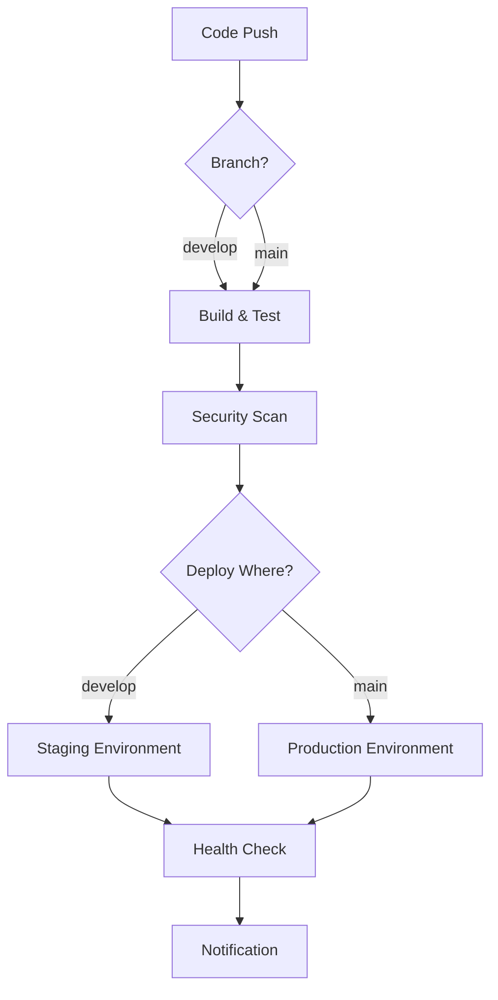

# 🔷 Complete Azure DevOps CI/CD Setup Guide

## 🎯 **What You'll Get**

A complete enterprise-grade CI/CD pipeline that:

✅ **Automatically builds** your frontend and backend  
✅ **Runs tests** with coverage reports  
✅ **Scans for security** vulnerabilities  
✅ **Builds Docker images** and pushes to Docker Hub  
✅ **Deploys to staging** when you push to `develop` branch  
✅ **Deploys to production** when you push to `main` branch  
✅ **Runs health checks** after deployment  
✅ **Provides rollback** capabilities  

## 🚀 **Quick Setup (5 Steps)**

### **Step 1: Run Infrastructure Setup**
```powershell
# Run the automated setup script
./scripts/setup-azure-devops.ps1
```

### **Step 2: Create Azure DevOps Project**
1. Go to [dev.azure.com](https://dev.azure.com)
2. Create new project: "DevOps E-Learning Platform"
3. Import your GitHub repository

### **Step 3: Create Service Connections**
1. **Project Settings** → **Service connections**
2. **Create Docker Hub connection**:
   - Type: Docker Registry
   - Name: `DockerHubConnection`
   - Username/Password: Your Docker Hub credentials
3. **Create Azure connection**:
   - Type: Azure Resource Manager
   - Name: `AzureServiceConnection`
   - Subscription: Your Azure subscription

### **Step 4: Set Up Variables**
1. **Pipelines** → **Library** → **Variable groups**
2. **Create group**: `devops-elearning-variables`
3. **Add variables**:
   - `MONGODB_URI`: `mongodb://mongo:27017/devops-elearning` (🔒 secure)
   - `JWT_SECRET`: Your JWT secret key (🔒 secure)

### **Step 5: Create Pipeline**
1. **Pipelines** → **Create Pipeline**
2. **Choose**: Azure Repos Git
3. **Select**: Your repository
4. **Configure**: Existing Azure Pipelines YAML file
5. **Path**: `/azure-pipelines.yml`
6. **Save and run**

## 🏗️ **Pipeline Architecture**



## 📋 **Pipeline Stages Explained**

### **🔨 Stage 1: Build and Test**
- **Frontend Build**: Node.js setup, npm install, lint, test, Docker build
- **Backend Build**: Node.js setup, npm install, lint, test, Docker build
- **Artifacts**: Docker images pushed to Docker Hub
- **Duration**: ~5-8 minutes

### **🔍 Stage 2: Security Scanning**
- **NPM Audit**: Scans for known vulnerabilities
- **Dependency Check**: Validates package security
- **Duration**: ~2-3 minutes

### **🧪 Stage 3: Deploy to Staging** (develop branch only)
- **Target**: Azure Container Apps staging environment
- **Trigger**: Push to `develop` branch
- **Environment**: `https://devops-backend-staging.azurecontainerapps.io`
- **Duration**: ~3-5 minutes

### **🚀 Stage 4: Deploy to Production** (main branch only)
- **Target**: Azure Container Apps production environment
- **Trigger**: Push to `main` branch
- **Environment**: `https://devops-backend.azurecontainerapps.io`
- **Approval**: Can require manual approval
- **Duration**: ~3-5 minutes

### **✅ Stage 5: Post-Deployment Testing**
- **Health Checks**: Verifies all services are running
- **Integration Tests**: Basic API endpoint testing
- **Monitoring**: Sets up application monitoring
- **Duration**: ~1-2 minutes

## 🌍 **Environments**

### **Staging Environment**
- **Purpose**: Testing and validation
- **Branch**: `develop`
- **URL**: `https://devops-frontend-staging.azurecontainerapps.io`
- **Database**: Staging MongoDB instance
- **Auto-deploy**: Yes (no approval required)

### **Production Environment**
- **Purpose**: Live application for users
- **Branch**: `main`
- **URL**: `https://devops-frontend.azurecontainerapps.io`
- **Database**: Production MongoDB instance
- **Auto-deploy**: Optional (can require approval)

## 🔄 **Development Workflow**

### **Feature Development:**
```bash
# 1. Create feature branch
git checkout -b feature/new-course-module

# 2. Make changes and commit
git add .
git commit -m "Add new course module"
git push origin feature/new-course-module

# 3. Create Pull Request to develop
# Pipeline runs build and tests automatically

# 4. Merge to develop
# Automatic deployment to staging environment

# 5. Test in staging
# Visit staging URL and verify changes

# 6. Create Pull Request to main
# Optional: Add approval requirements

# 7. Merge to main
# Automatic deployment to production
```

## 🔐 **Security Features**

### **Pipeline Security:**
- ✅ **Service connections** with least privilege access
- ✅ **Variable groups** with encrypted secrets
- ✅ **Environment approvals** for production deployments
- ✅ **Branch protection** rules
- ✅ **Audit logging** for all pipeline activities

### **Application Security:**
- ✅ **NPM audit** scanning for vulnerabilities
- ✅ **Docker image** security best practices
- ✅ **Environment variables** properly managed
- ✅ **HTTPS enforcement** on all endpoints
- ✅ **JWT token** validation

## 📊 **Monitoring and Alerts**

### **Pipeline Monitoring:**
- ✅ **Build success/failure** notifications
- ✅ **Test coverage** reports
- ✅ **Deployment status** tracking
- ✅ **Performance metrics** collection

### **Application Monitoring:**
- ✅ **Health check** endpoints
- ✅ **Application logs** centralized
- ✅ **Performance monitoring** with Azure Application Insights
- ✅ **Error tracking** and alerting

## 🔧 **Customization Options**

### **Deployment Triggers:**
```yaml
# Custom trigger configuration
trigger:
  branches:
    include:
      - main
      - develop
      - release/*
  paths:
    exclude:
      - docs/*
      - '*.md'
```

### **Environment Variables:**
```yaml
# Custom environment variables per stage
variables:
  - group: devops-elearning-variables
  - name: CUSTOM_FEATURE_FLAG
    value: 'enabled'
```

### **Approval Gates:**
```yaml
# Require manual approval for production
environment: 'production'
strategy:
  runOnce:
    deploy:
      steps:
        # Deployment steps here
```

## 🚨 **Troubleshooting**

### **Common Issues:**

#### **Service Connection Errors**
```
Error: Service connection 'DockerHubConnection' could not be found
```
**Solution**: Verify service connection names match exactly in pipeline

#### **Variable Group Errors**
```
Error: Variable group 'devops-elearning-variables' not found
```
**Solution**: Create variable group and link to pipeline

#### **Docker Push Failures**
```
Error: unauthorized: authentication required
```
**Solution**: Check Docker Hub credentials in service connection

#### **Azure CLI Errors**
```
Error: Resource provider not registered
```
**Solution**: Run `az provider register --namespace Microsoft.App`

### **Debug Commands:**
```bash
# Check Azure resources
az containerapp list --resource-group devops-elearning-rg

# View container logs
az containerapp logs show --name devops-backend --resource-group devops-elearning-rg

# Test health endpoint
curl https://devops-backend.azurecontainerapps.io/health
```

## 📈 **Performance Optimization**

### **Build Performance:**
- ✅ **Parallel jobs** for frontend/backend builds
- ✅ **npm cache** between builds
- ✅ **Docker layer** caching
- ✅ **Incremental builds** for unchanged components

### **Deployment Performance:**
- ✅ **Blue-green deployments** for zero downtime
- ✅ **Health checks** before traffic routing
- ✅ **Rollback capabilities** on failure
- ✅ **Auto-scaling** based on demand

## 💰 **Cost Management**

### **Azure DevOps Costs:**
- **Free tier**: 1,800 build minutes per month
- **Parallel jobs**: $40/month per additional job
- **Self-hosted agents**: Free (if you provide infrastructure)

### **Azure Container Apps Costs:**
- **Free tier**: First 180,000 vCPU-seconds and 360,000 GiB-seconds per month
- **Pay-as-you-go**: Only pay for actual usage
- **Auto-scaling**: Scales to zero when not in use

## 🎓 **Learning Resources**

### **Azure DevOps:**
- [Azure DevOps Documentation](https://docs.microsoft.com/en-us/azure/devops/)
- [YAML Pipeline Reference](https://docs.microsoft.com/en-us/azure/devops/pipelines/yaml-schema)
- [Azure DevOps Labs](https://azuredevopslabs.com/)

### **Azure Container Apps:**
- [Container Apps Documentation](https://docs.microsoft.com/en-us/azure/container-apps/)
- [Container Apps Samples](https://github.com/Azure-Samples/container-apps-store-api-microservice)

## ✅ **Success Checklist**

After setup, verify:
- [ ] Pipeline runs successfully on code push
- [ ] Tests pass and coverage is reported
- [ ] Docker images are built and pushed
- [ ] Staging deployment works from develop branch
- [ ] Production deployment works from main branch
- [ ] Health checks pass after deployment
- [ ] Application is accessible at provided URLs
- [ ] Monitoring and logging are working
- [ ] Rollback procedure is tested

## 🎉 **Conclusion**

You now have a production-ready CI/CD pipeline that demonstrates enterprise DevOps practices:

- ✅ **Automated testing** and quality gates
- ✅ **Security scanning** and vulnerability management
- ✅ **Multi-environment** deployment strategy
- ✅ **Infrastructure as Code** with Azure
- ✅ **Monitoring and observability**
- ✅ **Rollback and recovery** procedures

This pipeline showcases real-world DevOps skills that employers value! 🚀

## 🆘 **Need Help?**

If you encounter issues:
1. Check the [troubleshooting section](#-troubleshooting)
2. Review Azure DevOps pipeline logs
3. Verify all service connections and variables
4. Test Azure CLI commands manually
5. Contact Azure support if needed

Your enterprise-grade DevOps CI/CD pipeline is ready! 🎉
