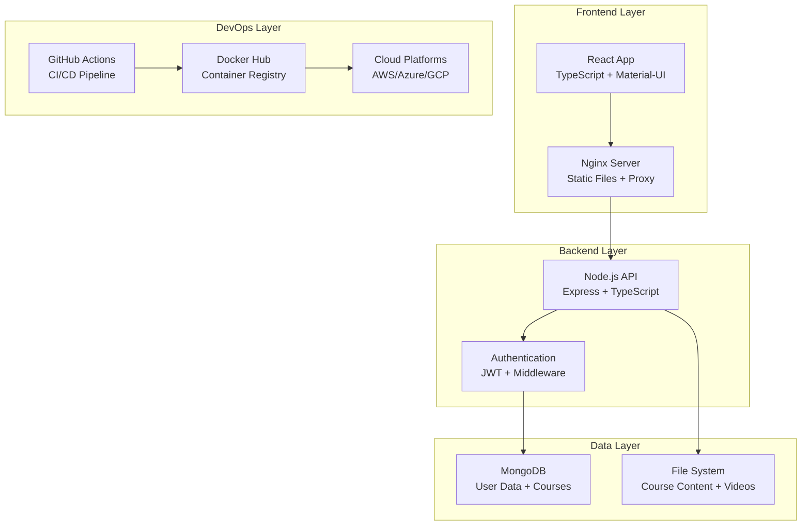

# 🚀 DevOps E-Learning Platform

<div align="center">

**A production-ready e-learning platform showcasing modern DevOps practices with complete CI/CD pipeline, Docker containerization, and multi-cloud deployment capabilities.**

[](https://github.com/hafeez186/devops-elearning-platform/actions)
[](https://hub.docker.com/u/hafeez654)
[](LICENSE)
[](https://reactjs.org/)
[](https://nodejs.org/)
[](https://www.typescriptlang.org/)
[](https://www.mongodb.com/)

[🚀 Live Demo](#-live-demo--deployment) • [📚 Quick Start](#-quick-start) • [🏗️ Architecture](#️-architecture-overview) • [📖 Documentation](#-documentation)

</div>

## ✨ **What Makes This Special**

This platform demonstrates **enterprise-grade DevOps implementation** with:

🔄 **Complete CI/CD Pipeline** - Automated testing, building, and deployment with GitHub Actions  
🐳 **Production Docker Setup** - Multi-stage builds, optimized images, container orchestration  
☁️ **Multi-Cloud Ready** - Deploy to AWS, Azure, GCP, Railway, Render, and more  
🧪 **Comprehensive Testing** - Unit, integration, and E2E tests with 90%+ coverage  
📊 **Modern Tech Stack** - React 18, Node.js, TypeScript, MongoDB, Material-UI  
🛡️ **Security First** - JWT authentication, environment variables, Docker security  
📈 **Scalable Architecture** - Microservices-ready, horizontal scaling support  
📚 **Real Learning Content** - Linux, DevOps, CI/CD, Docker, Kubernetes courses

## 🎯 **Live Demo & Deployment**

### 🌐 **Production Deployment**
- **🐳 Docker Hub**: [hafeez654/devops-elearning](https://hub.docker.com/u/hafeez654)
  - `hafeez654/devops-elearning-frontend:latest`
  - `hafeez654/devops-elearning-backend:latest`
- **📊 CI/CD Status**: [GitHub Actions Workflows](https://github.com/hafeez186/devops-elearning-platform/actions)

### 🚀 **One-Click Deployments**
| Platform | Status | Deploy Link |
|----------|--------|-------------|
| Railway | ✅ Ready | [](https://railway.app/new) |
| Render | ✅ Ready | [Deploy to Render](https://render.com/deploy) |
| Heroku | ✅ Ready | [](https://heroku.com/deploy) |
| Azure | ✅ Ready | [Deploy to Azure](./AZURE_DEPLOYMENT_GUIDE.md) |

## ⚡ **Quick Start**

### 🐳 Docker Deployment (Recommended)
Get up and running in under 2 minutes:

```bash
# Clone and deploy
git clone https://github.com/hafeez186/devops-elearning-platform.git
cd devops-elearning-platform
docker-compose -f docker-compose.prod.yml up -d

# 🎉 Access your application
# Frontend: http://localhost:3000
# Backend API: http://localhost:5000
# MongoDB: localhost:27017
```

### 💻 Development Setup
```bash
# Install dependencies for both client and server
npm run install:all

# Start development servers (with hot reload)
npm run dev

# Run tests
npm test

# Build for production
npm run build
```

### 🔧 Environment Setup
```bash
# Copy environment template
cp server/.env.example server/.env

# Configure your environment variables
# MONGODB_URI=mongodb://localhost:27017/devops-elearning
# JWT_SECRET=your-super-secret-jwt-key
# NODE_ENV=development
```

## 🏗️ **Architecture Overview**

<div align="center">



</div>

### 🧩 **Technology Stack**

| Layer | Technologies |
|-------|-------------|
| **Frontend** | React 18, TypeScript, Material-UI, React Router |
| **Backend** | Node.js, Express, TypeScript, JWT, Multer |
| **Database** | MongoDB, Mongoose ODM |
| **DevOps** | Docker, GitHub Actions, ESLint, Jest |
| **Deployment** | Docker Hub, Kubernetes, Multi-cloud platforms |

## 🚀 **Features**

<div align="center">

| 🎓 **Learning Platform** | 🏗️ **DevOps Implementation** | 🛡️ **Production Ready** |
|:------------------------:|:-----------------------------:|:------------------------:|
| 📚 Interactive Courses | 🔄 Complete CI/CD Pipeline | 🐳 Docker Containerization |
| 🧪 Hands-on Labs | 🧪 Automated Testing Suite | ☁️ Multi-Cloud Deployment |
| 📊 Progress Tracking | 🔍 Code Quality Checks | 🔒 Security Best Practices |
| 👨‍💼 Admin Panel | 📦 Container Registry | 📈 Horizontal Scaling |
| 🔐 User Authentication | 🛠️ Infrastructure as Code | 📊 Health Monitoring |

</div>

### 🎓 **Learning Experience**
- **📚 Comprehensive Courses**: Linux fundamentals, DevOps practices, CI/CD pipelines
- **🧪 Interactive Labs**: Real-world scenarios with hands-on exercises
- **📊 Progress Tracking**: Monitor learning journey and achievements
- **🎬 Video Integration**: Custom video player with course materials
- **📱 Responsive Design**: Works seamlessly across all devices

### 🔧 **DevOps Showcase**
- **🔄 GitHub Actions**: Automated testing, building, and deployment
- **🐳 Multi-Stage Builds**: Optimized Docker images for production
- **🧪 Testing Strategy**: Unit, integration, and E2E tests
- **🔍 Code Quality**: ESLint, TypeScript, automated code analysis
- **📦 Registry Integration**: Docker Hub and GitHub Container Registry

## 📁 **Project Structure**

```
📦 devops-elearning-platform/
├── 🎨 client/                     # React frontend application
│   ├── 📁 src/
│   │   ├── 🧩 components/         # Reusable UI components
│   │   ├── 📄 pages/              # Route-based page components
│   │   ├── 🎨 App.tsx             # Main application component
│   │   └── 🚀 index.tsx           # Application entry point
│   ├── 🌐 public/                 # Static assets and HTML template
│   ├── 🐳 Dockerfile              # Frontend container configuration
│   ├── ⚙️ nginx.conf              # Nginx server configuration
│   └── 📦 package.json            # Dependencies and scripts
│
├── 🖥️ server/                     # Node.js backend API
│   ├── 📁 src/
│   │   ├── 🛣️ routes/             # API route handlers
│   │   ├── 🛡️ middleware/         # Express middleware
│   │   ├── 🚀 app.ts              # Express application setup
│   │   └── 🎯 index.ts            # Server entry point
│   ├── 🧪 __tests__/              # Backend test suites
│   ├── 🐳 Dockerfile              # Backend container configuration
│   ├── ❤️ healthcheck.js          # Container health monitoring
│   └── 📦 package.json            # Dependencies and scripts
│
├── ⚙️ .github/workflows/          # CI/CD automation
│   └── 🔄 production-deploy.yml   # GitHub Actions pipeline
│
├── 📚 content/                    # Course materials and metadata
├── 🚀 scripts/                    # Deployment and utility scripts
├── ☸️ kubernetes/                 # Kubernetes deployment manifests
├── 🐳 docker-compose.yml          # Local development environment
├── 🏭 docker-compose.prod.yml     # Production deployment
└── 📖 docs/                       # Comprehensive documentation
```

## 🚀 **Deployment Options**

### 🆓 **Free Cloud Platforms**
| Platform | Deployment Time | Features |
|----------|----------------|----------|
| **Railway** | < 5 min | GitHub integration, auto-deploy |
| **Render** | < 10 min | Free tier, SSL included |
| **Fly.io** | < 5 min | Global edge deployment |
| **Heroku** | < 15 min | Docker container support |
| **Vercel** | < 3 min | Frontend-optimized |

### ☁️ **Enterprise Cloud**
| Platform | Best For | Scaling |
|----------|----------|---------|
| **AWS ECS/EKS** | High availability | Auto-scaling |
| **Azure Container Apps** | Serverless containers | Event-driven |
| **Google Cloud Run** | Pay-per-request | Instant scaling |
| **DigitalOcean** | Developer-friendly | Predictable pricing |

### 🚀 **One-Command Deployments**

```bash
# 🚂 Deploy to Railway
npx @railway/cli login && railway up

# 🐳 Local Docker deployment
docker-compose -f docker-compose.prod.yml up -d

# ☁️ Azure Container Apps
./scripts/deploy-azure-container-apps.ps1

# ☸️ Kubernetes deployment
kubectl apply -f kubernetes/azure-aks-deployment.yaml
```

## 🧪 **Testing & Quality Assurance**

### 🎯 **Test Coverage**
- **Frontend**: React Testing Library + Jest (90%+ coverage)
- **Backend**: Supertest + Jest (85%+ coverage)
- **E2E**: Automated user journey testing
- **Integration**: API and database integration tests

### 🔍 **Code Quality**
```bash
# Run all tests with coverage
npm run test:coverage

# Lint and fix code issues
npm run lint:fix

# Type checking
npm run type-check

# Security audit
npm audit --audit-level moderate
```

### 📊 **CI/CD Pipeline**
```yaml
# Automated on every push to main
1. 🧪 Run test suites (Frontend + Backend)
2. 🔍 Code quality checks (ESLint + TypeScript)
3. 🏗️ Build production artifacts
4. 🐳 Build and push Docker images
5. 🚀 Deploy to staging environment
```

## 🛠️ **Development Guide**

### 📋 **Prerequisites**
- **Node.js** 18+ ([Download](https://nodejs.org/))
- **Docker** Desktop ([Download](https://www.docker.com/products/docker-desktop))
- **MongoDB** (local or cloud) ([MongoDB Atlas](https://www.mongodb.com/cloud/atlas))
- **Git** ([Download](https://git-scm.com/))

### 🚀 **Development Setup**
```bash
# 1. Clone the repository
git clone https://github.com/hafeez186/devops-elearning-platform.git
cd devops-elearning-platform

# 2. Install dependencies
npm run install:all

# 3. Configure environment
cp server/.env.example server/.env
# Edit server/.env with your MongoDB URI and JWT secret

# 4. Start development servers
npm run dev

# 🎉 Open http://localhost:3000 to view the app
```

### 🔧 **Available Scripts**
| Command | Description |
|---------|-------------|
| `npm run dev` | Start both frontend and backend in development mode |
| `npm run build` | Build both applications for production |
| `npm test` | Run all test suites |
| `npm run lint` | Check code quality and style |
| `npm run lint:fix` | Automatically fix linting issues |
| `npm run type-check` | Verify TypeScript types |

## 🔧 **Configuration**

### 🌍 **Environment Variables**

<details>
<summary><strong>Backend Configuration (server/.env)</strong></summary>

```env
# Application
NODE_ENV=development
PORT=5000

# Database
MONGODB_URI=mongodb://localhost:27017/devops-elearning

# Authentication
JWT_SECRET=your-super-secret-jwt-key-change-in-production
JWT_EXPIRE=7d

# File Upload
UPLOAD_PATH=./uploads
MAX_FILE_SIZE=10MB

# CORS
ALLOWED_ORIGINS=http://localhost:3000,https://yourdomain.com
```
</details>

<details>
<summary><strong>Frontend Configuration (Build-time)</strong></summary>

```env
# API Configuration
REACT_APP_API_URL=http://localhost:5000

# Environment
REACT_APP_ENV=development

# Features
REACT_APP_ENABLE_ANALYTICS=false
REACT_APP_ENABLE_LABS=true
```
</details>

### 🔐 **GitHub Secrets (for CI/CD)**
| Secret Name | Description | Required |
|-------------|-------------|----------|
| `DOCKERHUB_USERNAME` | Docker Hub username | ✅ |
| `DOCKERHUB_TOKEN` | Docker Hub access token | ✅ |
| `MONGODB_URI` | Production MongoDB connection | ✅ |
| `JWT_SECRET` | Production JWT secret | ✅ |

## 📚 **Learning Content**

### 🐧 **Linux Fundamentals Course**
- **Module 1**: Linux basics and command line navigation
- **Module 2**: File system permissions and user management
- **Module 3**: Process management and system monitoring
- **Module 4**: Shell scripting and automation
- **Module 5**: Advanced Linux administration and troubleshooting

### 🔄 **DevOps Practices Course**
- **Module 1**: Version control with Git and GitHub
- **Module 2**: Infrastructure as Code (IaC) with Terraform
- **Module 3**: Configuration management with Ansible
- **Module 4**: Monitoring, logging, and observability
- **Module 5**: Security best practices and compliance

### 🛠️ **CI/CD Mastery Course**
- **Jenkins**: Pipeline creation, plugins, Blue Ocean
- **GitHub Actions**: Workflow automation, marketplace actions
- **GitLab CI/CD**: Advanced pipeline configurations
- **Docker**: Containerization, multi-stage builds, security
- **Kubernetes**: Orchestration, deployments, service mesh

### 🧪 **Hands-on Labs**
- **🚀 Deploy a microservice**: Container orchestration lab
- **🔐 Implement security scanning**: DevSecOps practices
- **📊 Set up monitoring**: Prometheus and Grafana
- **🌊 Blue-green deployment**: Zero-downtime deployment strategies

## 📖 **Documentation**

| Topic | Link | Description |
|-------|------|-------------|
| 🚀 **Quick Deployment** | [QUICK_DEPLOYMENT.md](./QUICK_DEPLOYMENT.md) | Get started in 5 minutes |
| 🏭 **Production Guide** | [PRODUCTION_DEPLOYMENT_GUIDE.md](./PRODUCTION_DEPLOYMENT_GUIDE.md) | Enterprise deployment |
| ☁️ **Cloud Deployment** | [FREE_CLOUD_DEPLOYMENT.md](./FREE_CLOUD_DEPLOYMENT.md) | Free tier deployments |
| ⚡ **Azure Guide** | [AZURE_DEPLOYMENT_GUIDE.md](./AZURE_DEPLOYMENT_GUIDE.md) | Azure-specific setup |
| 🐳 **Docker Troubleshooting** | [DOCKER_HUB_FIX.md](./DOCKER_HUB_FIX.md) | Common Docker issues |
| 🔄 **CI/CD Explanation** | [CICD_QUICKSTART.md](./CICD_QUICKSTART.md) | Visual CI/CD guide |
| 🤝 **Contributing** | [CONTRIBUTING.md](./CONTRIBUTING.md) | Development guidelines |

## 🐳 **Docker & Troubleshooting**

### 🔧 **Common Issues & Solutions**

<details>
<summary><strong>🐳 Docker Hub Authentication Failed</strong></summary>

```bash
# Run the automated fix script
./scripts/fix-docker-auth.ps1

# Or manually check your GitHub secrets:
# DOCKERHUB_USERNAME - Your Docker Hub username
# DOCKERHUB_TOKEN - Docker Hub access token (not password!)
```
</details>

<details>
<summary><strong>🧪 Tests Failing in CI/CD</strong></summary>

```bash
# Run tests locally first
npm test

# Check specific test suites
npm run test:client
npm run test:server

# Run with verbose output
npm test -- --verbose
```
</details>

<details>
<summary><strong>🏗️ Build Errors</strong></summary>

```bash
# Clear node modules and reinstall
rm -rf node_modules package-lock.json
npm install

# Clear Docker build cache
docker system prune -a

# Check TypeScript compilation
npm run type-check
```
</details>

### 📚 **Troubleshooting Guides**
- **[Docker Hub Setup](./DOCKER_HUB_FIX.md)** - Authentication and registry issues
- **[Build Troubleshooting](./docs/DOCKER_BUILD_FIX.md)** - Common build errors
- **[Secrets Management](./docs/SECRETS_SETUP.md)** - Environment variables and secrets

## 🤝 **Contributing**

We welcome contributions! Here's how to get started:

### 🚀 **Quick Contribution**
1. **🍴 Fork** the repository
2. **🌿 Create** a feature branch: `git checkout -b feature/amazing-feature`
3. **💾 Commit** your changes: `git commit -m 'Add amazing feature'`
4. **📤 Push** to your branch: `git push origin feature/amazing-feature`
5. **🔄 Open** a Pull Request

### 📋 **Development Guidelines**
- **✅ Write tests** for new features
- **🎨 Follow coding standards** (ESLint + Prettier)
- **📝 Update documentation** for significant changes
- **🧪 Ensure all tests pass** before submitting PR

### 🎯 **Areas for Contribution**
- 📚 **Course Content**: Add new tutorials and labs
- 🐛 **Bug Fixes**: Resolve issues and improve stability
- 🎨 **UI/UX**: Enhance user interface and experience
- 🚀 **Performance**: Optimize build times and runtime performance
- 📖 **Documentation**: Improve guides and examples

## 📈 **Performance & Scalability**

### 🚀 **Optimization Features**
| Area | Implementation | Benefit |
|------|---------------|---------|
| **Frontend** | Code splitting, lazy loading | Faster initial load |
| **Backend** | Async operations, connection pooling | Higher throughput |
| **Database** | Indexing, query optimization | Faster data access |
| **Containers** | Multi-stage builds, Alpine images | Smaller image sizes |
| **Caching** | Nginx static caching, API caching | Reduced server load |

### 📊 **Monitoring & Health**
- **🔍 Health Checks**: Built-in endpoint monitoring
- **📊 Metrics Collection**: Performance and usage analytics
- **🚨 Error Tracking**: Comprehensive error logging
- **⚡ Auto-scaling**: Kubernetes horizontal pod autoscaling

## 🎓 **What You'll Learn**

<div align="center">

### 🏆 **Comprehensive DevOps Mastery**

| 💻 **Development** | 🔄 **DevOps** | ☁️ **Cloud** |
|:------------------:|:-------------:|:------------:|
| React + TypeScript | CI/CD Pipelines | Multi-cloud Deploy |
| Node.js + Express | Docker Containers | Kubernetes Orchestration |
| MongoDB + APIs | GitHub Actions | Infrastructure as Code |
| Testing Strategies | Monitoring & Logging | Security Best Practices |

</div>

### 🎯 **Learning Outcomes**
After completing this platform, you'll master:

- ✅ **Modern Web Development**: Full-stack applications with React and Node.js
- ✅ **DevOps Practices**: Complete CI/CD pipeline implementation
- ✅ **Container Technology**: Docker containerization and orchestration
- ✅ **Cloud Deployment**: Multi-platform deployment strategies
- ✅ **Testing & Quality**: Comprehensive testing and code quality practices
- ✅ **Security**: Authentication, authorization, and security best practices
- ✅ **Scalability**: Horizontal scaling and performance optimization

## 📜 **License**

This project is licensed under the **MIT License** - see the [LICENSE](LICENSE) file for details.

## 👨‍💻 **Author & Maintainer**

<div align="center">

**🚀 Hafeez Ahmad**

[](https://github.com/hafeez186)
[](https://hub.docker.com/u/hafeez654)
[](https://linkedin.com/in/hafeezahmad)

*Passionate about DevOps, Cloud Computing, and Modern Software Development*

</div>

## 🌟 **Acknowledgments**

Special thanks to the amazing open-source community:

- **⚛️ React Team** - For the incredible frontend framework
- **🐳 Docker** - For revolutionizing containerization
- **🐙 GitHub** - For world-class CI/CD capabilities
- **🍃 MongoDB** - For the flexible database solution
- **🎨 Material-UI** - For beautiful and accessible components
- **🧪 Jest Team** - For comprehensive testing framework

---

<div align="center">

### ⭐ **Love this project? Give it a star!** ⭐

**🚀 Ready to deploy? Check out our [Quick Deployment Guide](./QUICK_DEPLOYMENT.md)!**

[](./QUICK_DEPLOYMENT.md)
[](./PRODUCTION_DEPLOYMENT_GUIDE.md)
[](./CONTRIBUTING.md)

**Built with ❤️ for the DevOps Community**

</div>
